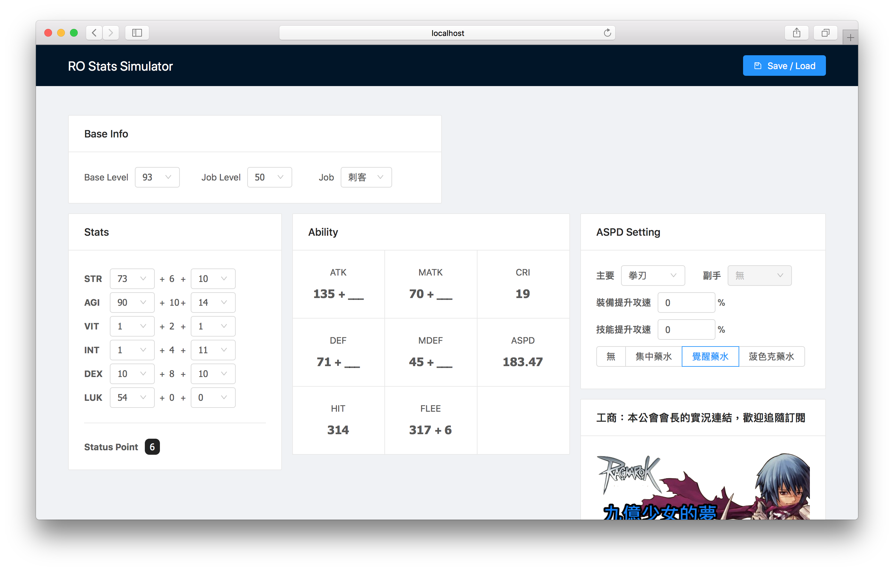

# RO Stats Simulartor



[](https://circleci.com/gh/jigsawye/rosim/tree/master)
[](https://beta.gemnasium.com/projects/github.com/jigsawye/rosim)

Build with React, Redux, antd, styled-components.

## Setup

``` bash
# create your .env file
cp .env.example .env

# update your environment variable
vim .env
```

## Build Setup

``` bash
# install dependencies
yarn

# serve with hot reload at localhost:8080
yarn start

# build for production with minification
yarn build
```

